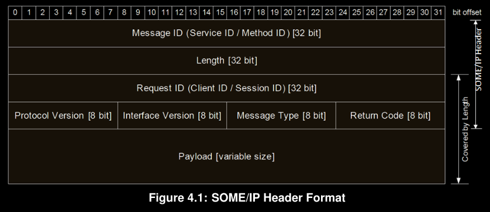

# **Scalable service-Oriented MiddlewarE over IP (SOME/IP)**

## #Terminologies:
   ### 1.Method 
   - A method, procedure, function, or subroutine that is called/invoked.
   ### 2.Remote Procedure Call (RPC)
   - A method call from one ECU to another that is transmitted using messages
   ### 3.Request
   - a message of the client to the server invoking a method
   ### 3.Response
   - a message of the server to the client transporting results of a method invocation       
   ### 4.Event
   - A uni-directional data transmission that is only invoked on changes or cyclically and is sent from the producer of data to the consumers
   ### 5.Field
   - A field does represent a status and thus has an valid value at all times on which getter, setter and notifier act upon.
   ### 6.Notification Event
   - An event message of the notifier of a field.
   ### 7.Getter
   - A Request/Response call that allows read access to a field.
   ### 8.Setter
   - A Request/Response call that allows write access to a field.
   ### 9.Notifier
   - Sends out event message with a new value on change of the value of the field.
   ### 10.Service
   - A logical combination of zero or more methods, zero or more events, and zero or more fields.
   ### 11.Server
   - The ECU offering a service instance shall be called server in the context of this service instance.
   ### 12.Client
   - The ECU using the service instance of a server shall be called client in the context of this service instance.
   
## #Message construction: 

   ### Header
   • Message ID (Service ID/Method ID) [32 Bits]
   • Length [32 Bits]
   • Request ID (Client ID/Session ID) [32 Bits]
   • Protocol Version [8Bits]
   • Interface Version [8 Bits]
   • Message Type [8 Bits]
   • Return Code [8 Bits]
   ### Payload
   • The size of the SOME/IP payload field depends on the transport protocol used. With UDP the SOME/IP payload shall be between 0 and 1400 Bytes. Since TCP supports segmentation of payloads, larger sizes are automatically supported

## #Request/Response Communication:

      
