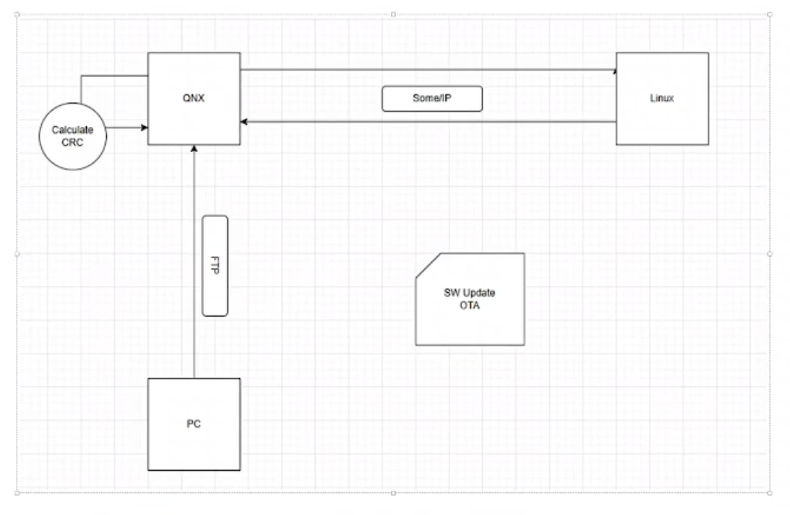
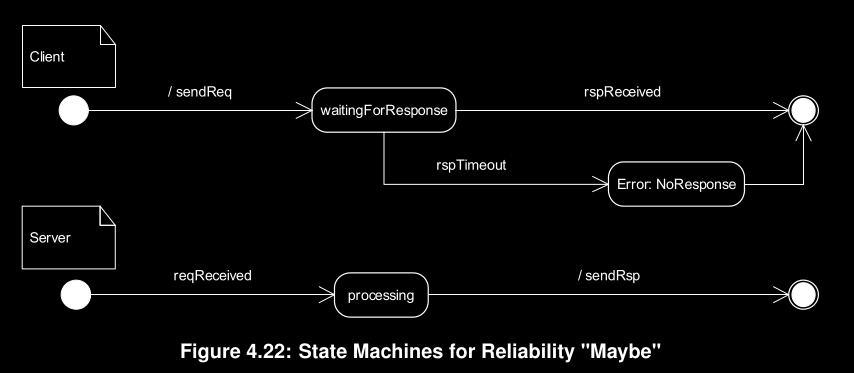

# System Requirments

## Hardware used:
  - Device (1): PC {linux imgae builder}
  - Device (2): just one of them:
      - Raspberri pi 3 {Running QNX}
        OR
      - V.M {Running QNX}
  - Device (3): Raspberri pi 4 {target H.W to be upadted remotly}

## The upadte (Payload):
 - Part (1): Image by yocto {linux kernel + u-boot}
 - Part (2): C++/QT application

## Communication protocls used:
 - Protocol (1): FTP between Device (1) & Device (2)
 - Protocol (2): SOME/IP (Based on TCP) between Device (2) & Device (3)
 - Protocol (3): V.M Shared directory 

## Integrity check:
 - Method: Cyclic redundancy check (CRC) check
 - Function: message digest algorithm 5 (md5)

## Description 
  - Step (1): Building C++/Qt application for device (3) on device (1)
  - Step (2): Building the image with app by yocto (payload) on device (1)
  - Step (3): Generate CRC code for payload on device (1)
  - Step (4):
      - If device (2) is raspberry pi 3, Sending the payload to device (2) using protocol (1) over wifi
      - If device (2) is V.M , Sending the payload to device (2) using protocol (3) locally on device (1)
  - Step (5): Generate CRC code for payload on device (2)
  - Step (6): Compare generated CRC code for payload between device (1) & device (2)
  - Step (7): Notifying using protocol (2) device (3) that there is a new update for payload over wifi
  - Step (8): Device (3) using protocol (2) request upadte version of payload & compare it with current version of payload over wifi
  - Step (9): Device (2) using protocol (2) response with upadte payload version over wifi
  - Step (10): 
      - If current payload version on device (3) is new, no upadte happend
      - If current payload version on device (3) is old, device (2) using protocol (2) request update payload from device (2) over wifi
  - Step (11): Device (2) using protocol (2) response with upadte payload version over wifi
  - Step (12): Device (3) applys upadte payload in its file system and then perform a reboot

# **Scalable service-Oriented MiddlewarE over IP (SOME/IP)**

## #Terminologies:
   ### 1.Method 
   - A method, procedure, function, or subroutine that is called/invoked.
   ### 2.Remote Procedure Call (RPC)
   - A method call from one ECU to another that is transmitted using messages
   ### 3.Request
   - a message of the client to the server invoking a method
   ### 3.Response
   - a message of the server to the client transporting results of a method invocation       
   ### 4.Event
   - A uni-directional data transmission that is only invoked on changes or cyclically and is sent from the producer of data to the consumers
   ### 5.Field
   - A field does represent a status and thus has an valid value at all times on which getter, setter and notifier act upon.
   ### 6.Notification Event
   - An event message of the notifier of a field.
   ### 7.Getter
   - A Request/Response call that allows read access to a field.
   ### 8.Setter
   - A Request/Response call that allows write access to a field.
   ### 9.Notifier
   - Sends out event message with a new value on change of the value of the field.
   ### 10.Service
   - A logical combination of zero or more methods, zero or more events, and zero or more fields.
   ### 11.Server
   - The ECU offering a service instance shall be called server in the context of this service instance.
   ### 12.Client
   - The ECU using the service instance of a server shall be called client in the context of this service instance.
   
## #Message construction: 

   ### Header
   - Message ID (Service ID/Method ID) [32 Bits]
   - Length [32 Bits]
   - Request ID (Client ID/Session ID) [32 Bits]
   - Protocol Version [8Bits]
   - Interface Version [8 Bits]
   - Message Type [8 Bits]
   - Return Code [8 Bits]
   
   ### Payload
   The size of the SOME/IP payload field depends on the transport protocol used. With UDP the SOME/IP payload shall be between 0 and 1400 Bytes. Since TCP supports segmentation of payloads, larger sizes are automatically supported

## #Request/Response Communication:

### The client has to do the following for payload and header:
- Construct the payload
- Set the Message ID based on the method the client wants to call
- Set the Length field to 8 bytes (for the part of the SOME/IP header after the length field) + length of the serialized payload
- Optionally set the Request ID to a unique number (shall be unique for client only)
- Set the Protocol Version according 
- Set the Interface Version according to the interface definition
- Set the Message Type to REQUEST (i.e. 0x00)
- Set the Return Code to 0x00

### The server builds the header of the response based on the header of the client’s request and does in addition:
- Construct the payload
- take over the Message ID from the corresponding request
- Set the length to the 8 Bytes + new payload size
- take over the Request ID from the corresponding request
- Set the Message Type to RESPONSE (i.e. 0x80) or ERROR (i.e. 0x81)
- set Return Code to the return code of called method or in case of an Error message to a valid error code.

## #Notification Events: 
(Update on change — send an update as soon as a "value" changes (e.g. dooropen))

Notifications describe a general Publish/Subscribe-Concept. Usually the server pub-
lishes a service to which a client subscribes. On certain cases the server will send the
client an event, which could be for example an updated value or an event that occurred.

### The server has to do the following for payload and header:
- Construct the payload
- Set the Message ID based on the event the server wants to send
- Set the Length field to 8 bytes (for the part of the SOME/IP header after the length field) + length of the serialized payload
- Set the Client ID to 0x00.
- Set the Session ID 
- Set the Protocol Version according [PRS_SOMEIP_00052]
- Set the Interface Version according to the interface definition
- Set the Message Type to NOTIFICATION (i.e. 0x02)
- Set the Return Code to 0x00
      
