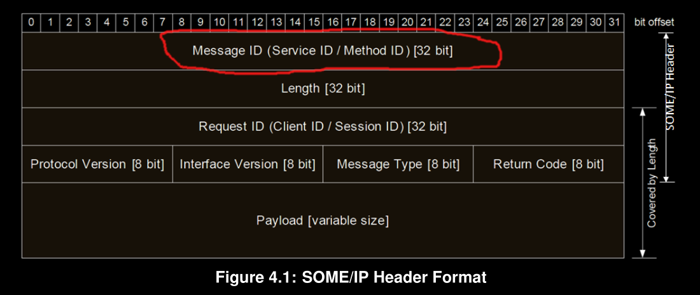

# **SOME/IP - SIQ**

## **What is the Method in {SOME/IP}:**
- A method, procedure, function, or subroutine that is called/invoked.
- A service can consist of combinations of zero or multiple events, methods and fields.
- Methods provide the possibility to the subscriber to issue remote procedure calls which are executed on provider side.
- The Message ID shall be a 32 Bit identifier that is used to identify:

  - the RPC call to a method of an application
  - or to identify an event.
  - [32 Bits] == {Service ID [16 bit] + [1 bit] + Event ID / Method ID [15 bit]}
  
- Method ID [15 Bit] Message IDs of method calls
- Payload might consists of data elements for events or parameters for methods.

## **What is the Event in {SOME/IP}:**
- A service can consist of combinations of zero or multiple events, methods and fields.
- Events provide data that are sent cyclically or on change from the provider to the subscriber.
- The major difference between the notifier of a field and an event is that events are only sent on change, the notifier of a field additionally sends the data directly after subscription.
- The Message ID shall be a 32 Bit identifier that is used to identify:
  - the RPC call to a method of an application
  - or to identify an event.
  - [32 Bits] == {Service ID [16 bit] + [1 bit] + Event ID / Method ID [15 bit]}
  
- Event ID [15 Bit] Eventgroup is a logical grouping of events and notification events of fields inside a service in order to allow subscription
