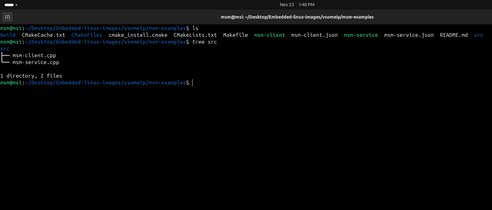

# ** Install & Run vsomeip on my Rpi**

## Build the example msm-service on PC
  - structure the msm-examples directory as the image down
  - write the CmakeLists.txt [file](./CMakeLists.txt)
  - write the msm-service.cpp [file](./msm-service.cpp)
  - write the service json [file](./msm-service.json)
  - then build it:
    - $ cd vsomeip/msm-vsomeip
    - $ cmake -Bbuild -DCMAKE_INSTALL_PREFIX=../install_folder -DENABLE_SIGNAL_HANDLING=1 .
    - $ cmake --build build --target install

## Build the example msm-client on Rpi 4
  - structure the vsomeip layer as the image down
  - structure the msm-vsomeip-app layer as the image down
  - write the msm-service.cpp [file](./msm-client.cpp)
  - write client json [file](./msm-client.json)
  - write both vsomeip bb [file](./vsomeip_git.bb) & msm-vsomeip-app bb [file](./msm-vsomeip-app_0.1.bb)
  - the build image:
    - $ bitbake vsomeip
    - $ bitbake msm-vsomeip-app
    - $ bitbake core-image-weston
      

## Run the example msm-service on PC
  - run commands:
    - $ export VSOMEIP_CONFIGURATION=home/msm/Desktop/Embedded-linux-images/msm-examples/msm-service.json 
	- $ export VSOMEIP_APPLICATION_NAME=World
    - $ export VSOMEIP_APPLICATION=World
    - $ sudo ip a add 172.17.1.1/24 dev enp4s0
	- $ sudo route add -nv  224.224.224.245 dev enp4s0

## Run the example msm-client on Rpi 4
  - run commands
    - $ export VSOMEIP_CONFIGURATION=/usr/etc/vsomeip/msm-client.json 
	- $ export VSOMEIP_APPLICATION_NAME=Hello
    - $ export VSOMEIP_APPLICATION=Hello
    - $ ip a add 172.17.1.2/24 dev eth0
    - $ route add -n  224.224.224.245 dev eth0  

	
	
	

