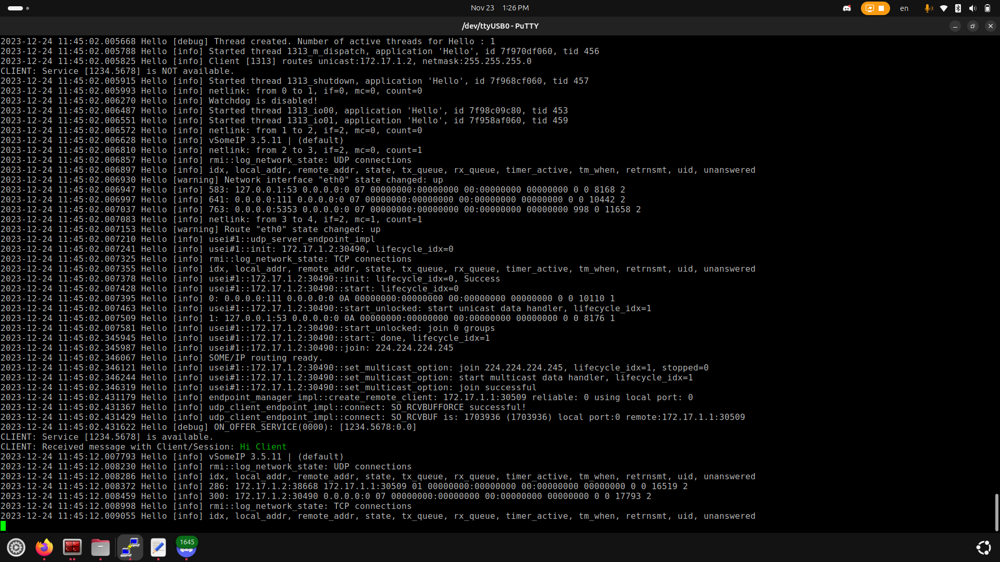
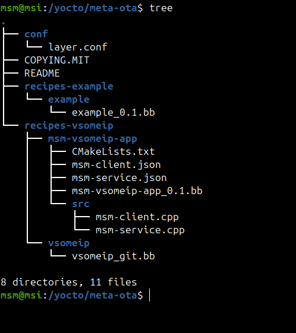

# ** Install vsomeip on my PC**

## Prerequisites
- $ sudo apt install dlt-daemon libdlt-dev
- $ sudo apt install libboost-all-dev

## Installation 
- $ git clone --depth=1 --branch=master https://github.com/COVESA/vsomeip
- $ cd vsomeip
- $ mkdir install_folder
- $ mkdir build

## Build the example hello_world
- $ cd msm-examples/hello_world
- $ cmake -Bbuild -DCMAKE_INSTALL_PREFIX=../../install_folder -DCMAKE_PREFIX_PATH=../../install_folder -DENABLE_SIGNAL_HANDLING=1 .
- $ cmake --build build/

## Run the example hello_world
- $ ./build/hello_world_service
- $ ./build/hello_world_client

