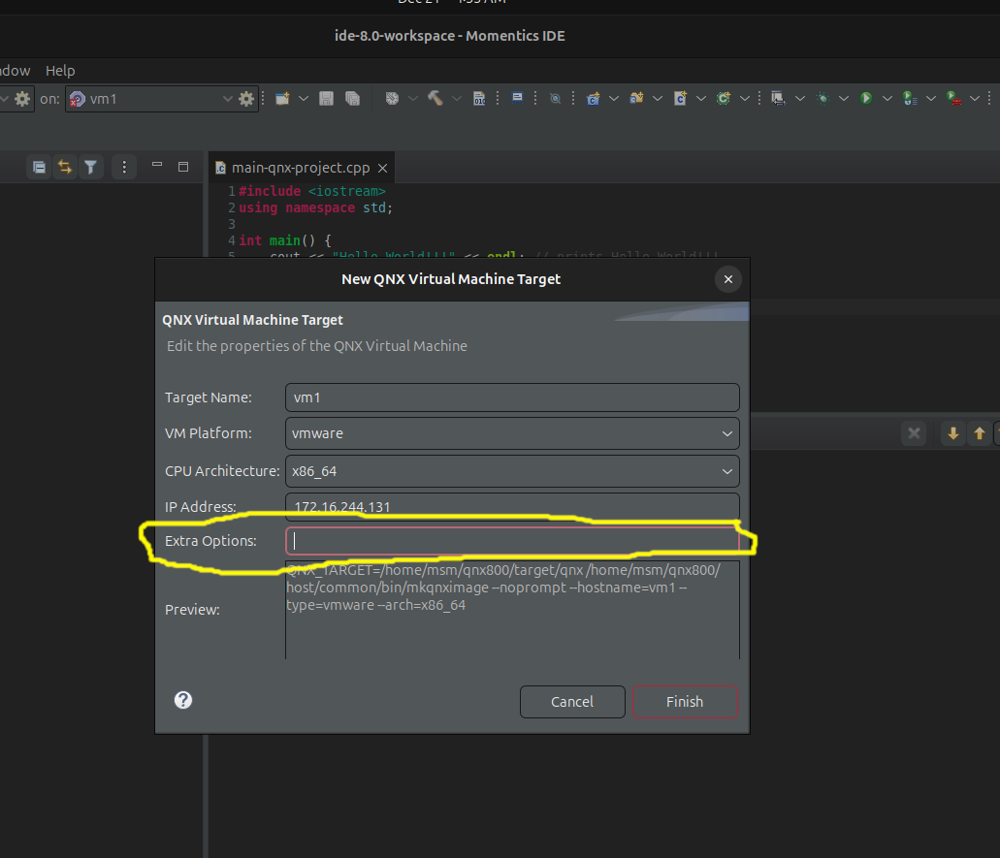

# **Integrate vsomeip library on qnx on vm**

## QNX {Running on VM} increase data section size to 5GB
- inside the extra options write: {--data-size='5120'}

## Build boost & vsomeip for QNX {Running on VM} on host machine {Ubuntu}

1. Create a workspace
- $ mkdir -p ~/qnx_workspace && cd ~/qnx_workspace
- $ WORKSPACE=${PWD}
- $ git clone https://github.com/qnx-ports/build-files.git	  
2. For vsomeip 3.4.10
- $ git clone https://github.com/qnx-ports/vsomeip.git  -b qnx_3.4.10
3. For SDP 8.0:
- $ source ~/qnx800/qnxsdp-env.sh
4. Clone boost
- $ cd ~/qnx_workspace
- $ git clone https://github.com/boostorg/boost.git && cd boost	  
5. For boost 1.78.0
- $ git checkout boost-1.78.0
- $ git submodule update --init --recursive
## For boost 1.78.0: apply an interprocess boost lib patch
- $ cd libs/interprocess && git apply $WORKSPACE/build-files/ports/boost/interprocess_1.78.0_qnx_7.1.patch
- $ cd -      	  
## Apply a tools patch for any boost
- $ cd tools/build && git apply $WORKSPACE/build-files/ports/boost/tools_qnx.patch
- $ cd $WORKSPACE
## SDP 8.0: build and install boost
- $ BOOST_CPP_VERSION_FLAG="-std=c++17" QNX_PROJECT_ROOT="$(pwd)/boost" make -C build-files/ports/boost install -j4	  
## Build vsomeip
- $ GTEST_ROOT=$GTEST_ROOT TEST_IP_MASTER="<QNX-target-ip-address>" TEST_IP_SLAVE="<Ubuntu-ip-address>" QNX_PROJECT_ROOT="$(pwd)/vsomeip" make -C build-files/ports/vsomeip install -j4
