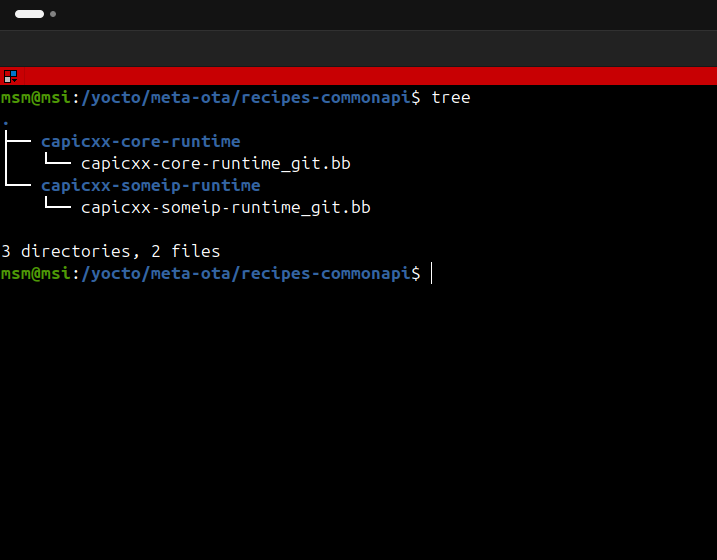
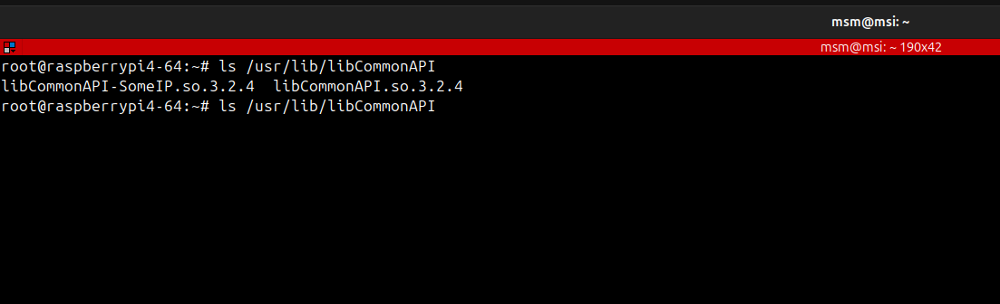

# Building both Common API Core & SomeIp for PC / Rpi4 / QNX {Running on VM}

## Libraries versions used

**1. Host machine {Ubuntu}**
- Vsomeip version 		      {3.5.11}
- boost version   		      {1.78.0}
- qnx SDP version 		      {8.0}
- common-api-core-runtime 	{3.2.4}
- common-api-someip-runtime {3.2.4}

**2. QNX {Running on VM}**
- Vsomeip version 			{3.4.10}
- boost version   			{1.78.0}
- qnx SDP version 			{8.0}
- common-api-core-runtime 	{3.2.4}
- common-api-someip-runtime {3.2.4}

	  
**3.Target machine: Rpi4**
- Vsomeip version 			{3.5.11}
- boost version   			{1.78.0}
- common-api-core-runtime 	{3.2.4}
- common-api-someip-runtime {3.2.4}
		
## Host machine {Ubuntu} 

### delete old boost & change version of boost on pc
	  
	$ sudo apt remove --purge 'libboost*'
	$ sudo apt autoremove --purge
	$ wget http://sourceforge.net/projects/boost/files/boost/1.78.0/boost_1_78_0.tar.gz
	$ tar -xf boost_1_78_0.tar.gz
	$ cd boost_1_78_0/
	$ ./bootstrap.sh --prefix=/usr/
	$ sudo ./b2
	$ sudo ./b2 install
	$ sudo ldconfig
	  	  
	  
### build CommonApi-core-runtime on pc

**1. Download repo**

	$ git clone https://github.com/COVESA/capicxx-core-runtime.git 
	$ cd capicxx-core-runtime/
	$ mkdir build
	$ cd build
	  
**2. fix build {apply patch [file](./capicxx_core_fix_build.patch)}**

	$ git apply name-of-patch-file.patch
	$ cmake -D CMAKE_INSTALL_PREFIX=/usr/local ..
	$ make -j
	$ sudo make install	  
	  
### build CommonApi-someip-runtime on pc

    $ git clone https://github.com/COVESA/capicxx-someip-runtime 
	$ cd capicxx-someip-runtime/
	$ cmake -D USE_INSTALLED_COMMONAPI=ON -D CMAKE_INSTALL_PREFIX=/usr/local ..
	$ make -j
	$ sudo make install

## RPI

		  
### build CommonApi-core-runtime on rpi

**1. Download repo**

	$ devtool add capicxx-core-runtime https://github.com/COVESA/capicxx-core-runtime.git --srcbranch=master
	$ devtool finish capicxx-core-runtime ../meta-ota/recipes-commonapi/capicxx-core-runtime

**2, Edit recipe**
- edit recipe file as this  [file](./capicxx-core-runtime_git.bb)

**3. Build Image 
- add recipe name to {IMAGE_INSTALL} in distro.conf

	  	
### build CommonApi-someip-runtime on rpi

**1. Download repo**

	  - $ devtool add capicxx-someip-runtime https://github.com/COVESA/capicxx-someip-runtime.git --srcbranch=master
	  - $ devtool finish capicxx-someip-runtime ../meta-ota/recipes-commonapi/capicxx-someip-runtime

**2, Edit recipe**
- edit recipe file as this  [file](./capicxx-someip-runtime_git.bb)

**3. Build Image 
- add recipe name to {IMAGE_INSTALL} in distro.conf
	  
			

